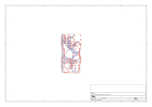

# SIM7600 Breakout Board

*Needs a cooler name, huh?*

## TLDR

This project is a 4 layer PCB built around the SIM7600 to expose all of it's functionality to make it usable/hackable for a wide range of devices, with a form factor that can fit beautifully on a 30 row breadboard.

## Why?

The intent of this was to be able to experiment with 4G/LTE, learn more about how cellular networks function, and to eventually build something that utilizes these networks along with the SIM7600.

## Features (v0.1)

- All antennas (main, aux, GPS) are broken out into external U.FL antenna receptacles 
- USB-C 2.0 receptacle for USB interfacing (not powering)
- Nano SIM card slot
- Headphone jack for listening to phone audio, on board mic for sending phone audio
- UART, I2C, & SPI voltage shifter to allow for more devices to utilize with the SIM7600's 1.8V interfaces
- 30 labeled pins spaced at 2.54mm/0.1in to allow for easy breadboard placing
- Indicator LEDs

## KiCAD

Each version recieves it's own directory under `hardware/`. In each version directory, the following KiCAD assets can be found:
 - Symbols -> `lib_sch/`
 - Footprints -> `sim7600_breakout.pretty/`
 - 3D models -> `3dmodels/`

## Usage Pre-Requisites

- A fully assembled lamemakes SIM7600 Breakout Board
- Antennas for respective purposes
    - 50Ω passive LTE/4G w/ U.FL connector
    - 50Ω **active/powered** GPS/GNSS w/ U.FL connector)
- An activated Nano SIM card
    - Carrier _shouldn't_ matter, see **IMEI** section
- Device that supports some form of serial communication
    - UART, I2C, and SPI are all supported.
- _(Optional)_ Wired headphones, ideally with about a 35Ω impedence.

## Usage 

The breakout board can be initialized by connecting +3.3v to the +3v3 pin, and ground to the GND pin. Then, turn the module on by pulling the PKEY HIGH.

## Pics

*Schematic*

*PCB*

## Notes

- **Be a good neighbor on the RF spectrum!** There is certainly a lot of grey area when it comes to legality and LTE/carrier service, so be conscientious - stay within local law. 
- Contribute! This is my first real RF/4G PCB, so if you see somewhere that could be improved feel free to raise an issue or put up a PR.
- As this is assembled and tinkered with, this README will be immensely updated for better usage instructions.
- It's clear the language barrier is an issue when it comes to the SIM7600 docs, but these resources helped me out a ton:
    - [Xinyuan LilyGO/T](https://github.com/Xinyuan-LilyGO/T-SIM7600X)
    - [CircuitMess Ringo](https://github.com/CircuitMess/CircuitMess-Ringo) <- such a cool project, look to do something very similar moving forward
    - [Waveshare SIM7600 HAT docs](https://www.waveshare.com/wiki/SIM7600E-H_4G_HAT)
